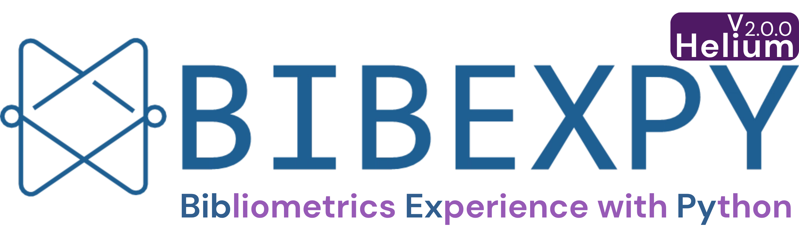

<p align="center">
  <a href="https://bibexpy.com">
    
  </a>
</p>

<p align="center">
  <strong>Self-hosted, reproducible bibliometric data preparation for Web of Science &amp; Scopus.</strong>
</p>

<p align="center">
  <a href="https://pypi.org/project/bibexpy/"></a>
  <a href="https://pypi.org/project/bibexpy/"></a>
  <a href="https://www.gnu.org/licenses/gpl-3.0"></a>
  <a href="https://doi.org/10.1016/j.softx.2025.102098"></a>
  <a href="https://colab.research.google.com/github/bcankara/BibexPy-Lite/blob/main/BibexPy_Lite.ipynb"></a>
</p>

<p align="center">
  🌐 <a href="https://bibexpy.com">bibexpy.com</a> ·
  📚 <a href="https://bibexpy.com/doc">Documentation</a> ·
  📄 <a href="https://doi.org/10.1016/j.softx.2025.102098">Paper (SoftwareX)</a> ·
  ▶️ <a href="https://www.youtube.com/@BibexPy">YouTube</a>
</p>

---

**BibexPy v2 (“Helium”)** — the successor to v1 (“Hydrogen”) — turns the original
command-line BibexPy into a **local web platform**, shipped as a single pip-installable
package. It merges, filters, harmonizes, enriches and exports Web of Science + Scopus
records with full provenance, and **never sends your licensed exports off your machine**.

<p align="center">
  
</p>

### Two ways to use BibexPy

| | What it is | Best for |
|---|---|---|
| **Full app** (this repo) | `pip install bibexpy` → a local web platform: merge → filter → harmonize → enrich → export → report. | The complete, reproducible workflow on your own machine. |
| **[BibexPy-Lite](https://github.com/bcankara/BibexPy-Lite)** [](https://colab.research.google.com/github/bcankara/BibexPy-Lite/blob/main/BibexPy_Lite.ipynb) | A lightweight notebook/terminal tool that runs the **same Smart Merge algorithm** — no web UI, no enrichment. | A quick WoS + Scopus **merge** in Google Colab or a terminal. |

Both share one merge algorithm, so results are identical.

## Install

```bash
pip install bibexpy    # macOS / Linux: pip3 install bibexpy
python -m bibexpy      # macOS / Linux: python3 -m bibexpy   (browser opens automatically)
```

> **macOS / Linux:** on most systems the commands are **`python3` / `pip3`** — plain
> `python`/`pip` may not exist (or may point to an old Python 2). If `pip3` itself is
> missing, install it first: `python3 -m ensurepip --upgrade`
> (Debian/Ubuntu: `sudo apt install python3-pip`). On Windows it is usually
> `python` / `pip`.

**`python -m bibexpy` is the recommended way to start the app** — it works on every setup
out of the box, with no PATH configuration. The short `bibexpy` command works too once your
Python `Scripts` folder is on PATH — see
[Add `bibexpy` to PATH (Windows)](#add-bibexpy-to-path-windows) below.

Requires only **Python 3.10+** — no Node.js/npm needed (the Next.js UI ships precompiled
inside the wheel). Works on Windows, macOS and Linux.

```bash
python -m bibexpy --port 8080        # custom port
python -m bibexpy --no-browser       # server only
python -m bibexpy --storage ./data   # custom storage folder
python -m bibexpy --version          # → BibexPy 2.0.x (Helium)
```

(The short `bibexpy` command accepts exactly the same options.)

Projects/data live under `~/.bibexpy/storage`; settings and API keys under `~/.bibexpy/.env`
(managed from the in-app Settings page).

### Add `bibexpy` to PATH (Windows)

pip installs a `bibexpy.exe` launcher into your Python `Scripts` folder. With **Microsoft
Store Python** or `pip install --user`, that folder is usually **not** on PATH, so PowerShell
replies `bibexpy : The term 'bibexpy' is not recognized…`. Nothing is broken —
`python -m bibexpy` always works. To enable the short command as well:

- **Easiest** — start the app once with `python -m bibexpy`: it detects the situation and
  **offers to add itself to PATH** — answer <kbd>Y</kbd>, open a new terminal, done. (In
  non-interactive shells it prints a personalized copy-paste command instead; you can also
  force it with `python -m bibexpy --add-path`.)
- **Manual** — paste this into PowerShell, then open a **new** terminal:

  ```powershell
  $s = python -c "import sysconfig, os; c=[sysconfig.get_path('scripts','nt_user'), sysconfig.get_path('scripts')]; print(next((p for p in c if 'WindowsApps' not in p and os.path.exists(os.path.join(p,'bibexpy.exe'))), c[0]))"
  [Environment]::SetEnvironmentVariable("Path", [Environment]::GetEnvironmentVariable("Path","User") + ";$s", "User")
  ```

- **Or use [pipx](https://pipx.pypa.io)** — `pipx install bibexpy` manages PATH for you.

On macOS/Linux the `bibexpy` command is normally on PATH right after `pip install`.

## What's new in v2

- **Built-in sample dataset** — the first launch creates a ready-to-explore **Simple
  Project** (real Web of Science + Scopus exports), so you can try the whole pipeline
  before uploading your own data.
- **One-click Smart Merge** — staged record linkage with a **DOI-determinative** rule
  (records whose normalized DOIs differ are never merged), identifier matching, and
  Jaro–Winkler title similarity with confidence scoring, plus field-level merging. Pairs
  it cannot resolve with certainty are kept separate and offered for an optional review
  right in the merge step. The result includes a copy-ready methodology paragraph.
- **ORCID-first author disambiguation** — ORCID identifiers as deterministic evidence, with a
  constrained field-similarity fallback only when coverage is incomplete.
- **Address harmonization** — organization roll-up to a canonical parent institution +
  country standardization.
- **Multi-source enrichment** — fetch-once-fill-all across CrossRef, OpenAlex, Scopus,
  DataCite, Unpaywall, Europe PMC and Semantic Scholar; reverse-DOI recovery; identity
  fields (ORCID/ROR). Verifiable sources only — no ML-inferred metadata.
- **Reproducible filtering** — multi-facet inclusion/exclusion criteria, saved as reusable
  presets.
- **Quality dashboard** — a bibliometrically weighted health score + an exportable General
  Overview table (CSV / XLSX / PNG).
- **Provenance** — append-only audit log, pre-operation snapshots, isolated analyses, and an
  auto-generated methodology narrative for your paper's data-preparation section.
- **Structured export** — WoS plain text, VOSviewer TSV, BibTeX, RIS, CSV, TSV, XLSX
  (interoperable with VOSviewer & Biblioshiny).

## Workflow

A guided five-step pipeline:

**Data & Merge → Records & Filtering → Harmonization → Export → Report**

Raw Scopus (`.csv`) and Web of Science (`.txt`) exports are uploaded and merged in a single
click (file preparation runs implicitly), and each merge is stored as an isolated,
reproducible analysis.

## Repository layout

```
apps/
  web/              # Next.js 14 frontend (static-exported into the wheel)
  api/              # FastAPI backend (documented HTTP API under /api)
packages/
  bibex_core/       # core bibliometric library (converters, merge, C1 utils, …)
python_pkg/         # PyPI packaging — builds the single pip wheel
scripts/            # build_wheel.sh / build_wheel.ps1
.github/workflows/  # release.yml — tag → wheel → PyPI (Trusted Publishing)
```

The published wheel bundles the **prebuilt** frontend (`_web`) + backend (`_server`) +
vendored core, so end users need no Node.js. Those build-time copies are git-ignored — the
source of truth is `apps/` and `packages/`, and the wheel is regenerated by CI.

## Development

```bash
# Backend (port 8001)
cd apps/api
pip install -r requirements.txt
pip install -e ../../packages/bibex_core
uvicorn main:app --reload --port 8001

# Frontend (port 3000) — separate terminal
cd apps/web
npm install
npm run dev
```

Then open <http://localhost:3000>. Run tests with `cd apps/api && python -m pytest -q`.

## Build the wheel (maintainers)

```bash
bash scripts/build_wheel.sh      # macOS / Linux
pwsh scripts/build_wheel.ps1     # Windows
```

→ `python_pkg/dist/bibexpy-<version>-py3-none-any.whl` — a pure-python `py3-none-any` wheel
that installs on Windows / macOS / Linux with no compiler.

## Release

Tagging a version triggers GitHub Actions, which builds the wheel (with Node) and publishes
it to PyPI via **Trusted Publishing (OIDC)** — no API tokens stored:

```bash
git tag v2.0.0 && git push origin v2.0.0
```

## Links

[Website](https://bibexpy.com) ·
[Docs](https://bibexpy.com/doc) ·
[BibexPy-Lite (Colab)](https://github.com/bcankara/BibexPy-Lite) ·
[YouTube](https://www.youtube.com/@BibexPy) ·
[X / Twitter](https://twitter.com/BibexPy) ·
[Instagram](https://www.instagram.com/bibexpy/) ·
[Paper (SoftwareX)](https://doi.org/10.1016/j.softx.2025.102098)

## License

[GPL-3.0-or-later](https://www.gnu.org/licenses/gpl-3.0).

## Citation

If you use BibexPy in your research, please cite:

> Kara, B. C., Şahin, A., & Dirsehan, T. (2025). BibexPy: Harmonizing the bibliometric
> symphony of Scopus and Web of Science. *SoftwareX*, 30, 102098.
> <https://doi.org/10.1016/j.softx.2025.102098>

```bibtex
@article{bibexpy2025,
  title   = {BibexPy: Harmonizing the bibliometric symphony of {Scopus} and {Web of Science}},
  author  = {Kara, Burak Can and {\c{S}}ahin, Alperen and Dirsehan, Ta{\c{s}}k{\i}n},
  journal = {SoftwareX},
  volume  = {30},
  pages   = {102098},
  year    = {2025},
  doi     = {10.1016/j.softx.2025.102098}
}
```
